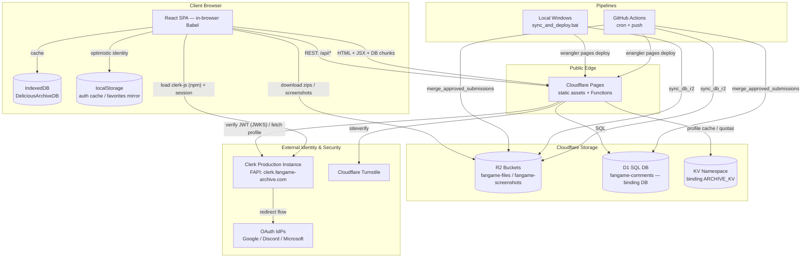

# Fangame Archive Explorer — System Architecture & Developer Reference

A complete technical specification of the **Fangame Archive Explorer**: a serverless, client-rendered catalog and review platform hosting **20,000+ games** and **156,000+ user reviews**. This document describes *what each subsystem is*, *the mechanism by which it is implemented*, and *how each capability is invoked* — both client-side (browser globals, React hooks) and server-side (HTTP endpoints, bindings).

> **Audience:** developers maintaining or extending the system. Every endpoint, binding, environment variable, and runtime contract referenced here is grounded in the live source under `functions/`, `src/`, `pipelines/`, and `database/`.

---

## 1. System Topology

The stack is fully serverless and decoupled: a static React SPA on Cloudflare Pages, server logic in Pages Functions (Workers runtime), and state split across R2 (objects), D1 (SQL), and KV (cache). Identity is delegated to Clerk; bot mitigation to Cloudflare Turnstile.



### 1.1 Infrastructure Components

| Component | Role | Binding / Host | Key constraint |
|---|---|---|---|
| **Cloudflare Pages** | Static hosting + Pages Functions (Workers) | project `fangame-archive` | 25 MB per-file limit → drives DB chunking |
| **Cloudflare R2** | Game zips + screenshots + master JSON | `fangame-files`, `fangame-screenshots` | served via `file.`/`screenshots.fangame-archive.com` |
| **Cloudflare D1** | SQL for users, comments, submissions, favorites, audit | binding `DB` → `fangame-comments` | accessed only from Functions |
| **Cloudflare KV** | Clerk profile cache + per-user daily quotas | binding `ARCHIVE_KV` | TTL-based expiry |
| **Clerk** | Identity, sessions, OAuth, account UI | FAPI `clerk.fangame-archive.com` | production keys (`pk_live`/`sk_live`) |
| **Turnstile** | CAPTCHA on writes | site key in `index.html`, secret in env | verified server-side |
| **GitHub Actions** | Scheduled (6 h) + push pipelines | `.github/workflows/deploy.yml` | orchestrates sync/scrape/build/deploy |

### 1.2 Runtime Configuration Reference

**Bindings** (`wrangler.toml`):
- `DB` — D1 database `fangame-comments` (`database_id` pinned in `wrangler.toml`).
- `ARCHIVE_KV` — KV namespace for profile cache and quotas.
- Pages build output: `github_pages_dist/`.

**Server environment variables** (Cloudflare Pages → Settings → Environment variables; **must redeploy after changes**):
- `CLERK_PUBLISHABLE_KEY` — `pk_live_…`; used to derive the JWKS URL for token verification.
- `CLERK_SECRET_KEY` — `sk_live_…`; used for Clerk Backend API profile lookups.
- `TURNSTILE_SECRET_KEY` — Turnstile siteverify secret (falls back to the Cloudflare test key if unset).

**Client globals injected in `public/index.html`:**
- `window.CLERK_PUBLISHABLE_KEY`, `window.CLERK_JS_URL` (FAPI-hosted SDK URL), `window.TURNSTILE_SITE_KEY`.
- `window.SCREENSHOT_BASE_URL`, `window.DATABASE_VERSION`, `window.APP_VERSION`, `window.ADMIN_URL`.

**Pipeline / CI credentials** (GitHub Actions secrets; locally `pipelines/config.py` and/or `.env`, both git-ignored — see [`.env.example`](.env.example)):
- `CLOUDFLARE_ACCOUNT_ID`, `AWS_ACCESS_KEY_ID` / `AWS_SECRET_ACCESS_KEY` — R2 (S3-compatible) access for `sync_db_r2.py`, screenshot/game uploads.
- `CLOUDFLARE_API_TOKEN` — a single token scoped for **D1 edit + Pages deploy** (and used by `wrangler` for both the review sync §8.7 and `pages deploy`). Keep it least-privilege; rotating it requires updating the GitHub secret only (no redeploy needed for pipeline steps, but Pages env-var rotations do — §7).

> **Security posture (by design).** CORS is `Access-Control-Allow-Origin: *` and the read endpoints (`/api/search`, `GET /api/comments`, `/api/me`) are intentionally public — the catalog is open data. All **writes** require a verified Clerk JWT (§3.5) plus Turnstile (§4.1); roles are resolved server-side from D1 and never trusted from the client (§6). Secrets live only in Pages env vars / CI secrets, never in the repo or client bundle.

---

## 2. Data Model

Bulk catalog data lives as JSON in R2 (mirrored locally under `data/`/`database/`, git-ignored except `*.sample.json`). Live, user-mutable state lives in D1.

### 2.1 Catalog JSON (R2 / build inputs)

**`data/games.json`** — map of sequential string ID → game object:
```json
{
  "3": {
    "id": 3,
    "title": "(Demo) I wanna practice the making 2",
    "creator": { "name": "AHS1222", "url": "https://delicious-fruit.com/..." },
    "avg_rating": 8.4,          // float | null (unrated)
    "avg_difficulty": 50.0,     // float 0–100 | null
    "download_url": "https://file.fangame-archive.com/Game/3.zip",
    "tags": ["needle"],
    "screenshots": [{ "id": 28023, "image_path": "ratings/screenshots/24176_00006d77.png", "by": "Anonymous" }],
    "reviews": [ /* … */ ],
    "rating_count": 3,
    "file_size": 5952231,       // bytes
    "engine": "GameMaker: Studio 2"   // optional; absent = unknown
  }
}
```
*Schema properties:* `avg_rating` — float average rating or `null` if unrated; `avg_difficulty` — float average difficulty (0–100) or `null`; `rating_count` — number of comments/reviews; `file_size` — size of the zip archive in bytes; `engine` — clean English engine name (e.g. `GameMaker 8`, `GameMaker: Studio`, `GameMaker: Studio 2`, `Multimedia Fusion 2`, `Unity`), set by the one-time v2026.009 backfill and kept current by the CI engine-recognition pipeline (§8.8); missing/`null` renders as *Unknown*; `release_date` — `"YYYY-MM-DD"` string, **key absent when unknown**. Sourced from Delicious Fruit's advanced-search "Released between" filter (the only place DF exposes dates): a one-time windowed harvest (`harvest_release_dates.py` → committed `data/release_dates.json` → `backfill_release_dates.py` CI step) plus a per-run sweep for new games (§8.1); wiki-only games use their wiki entry's organic `created_at` (entries bulk-imported 2019-11-14 don't count). First-writer-wins — an existing date is never overwritten.

**`data/recent_changes.json`** — monotonic `version` + `timeline` of deltas, enabling incremental client sync. Each timeline entry carries a `timestamp`, an `updated` map (id → new game object), and a `deleted` array:
```json
{
  "version": 70,
  "timeline": {
    "70": {
      "timestamp": 1780962800,
      "updated": { "125": { "id": 125, "title": "Updated Title", "...": "..." } },
      "deleted": []
    }
  }
}
```

**`database/seq_to_orig_map.json`** — maps local sequential IDs to their origin IDs (Delicious Fruit IDs or I Wanna Wiki IDs) plus provenance flags (`new_game`/`wiki_game`/`title_match`, `tags_synced`):
```json
{
  "3": ["24176", "new_game", "tags_synced"],
  "20951": ["WIKI-46280", "wiki_game", "tags_synced"]
}
```
A mapping may persist as a **tombstone** after its game is removed from `games.json` by the duplicate-resolution tool — this intentionally keeps the origin id "claimed" so the live-scrape reconcile won't re-add the duplicate (see §8.6). Consumers must not assume a mapped sequential id still exists in `games.json`.

> `games.json` carries one resolution-derived state worth noting: a **`clear_link`** game keeps its full entry but with `download_url: null` and `file_size: 0` — it stays searchable but is not downloadable, and is excluded from the storage-size total.

**`temp/reviews_scraped.json`** — the complete offline corpus of ~156,800 user reviews. Each entry:
```json
{
  "author": "Moowool",
  "user_id": 1234,
  "game_id": 24176,
  "game_title": "(Demo) I wanna practice the making 2",
  "text": "Outstanding visuals!",
  "likes": 0,
  "rating": 8.4,
  "difficulty": 50,
  "date": "Jan 10, 2022",
  "tags": []
}
```
> **Reviews live in two stores — this is the single most important thing to know about them.** `reviews_scraped.json` is the offline corpus and is consumed **only** to compute `avg_rating`/`avg_difficulty`/`rating_count` into `games.json`. The detail drawer, however, renders review **text from D1** (`/api/comments`, §4). The two are bridged by [`sync_reviews_to_d1.py`](#87-reviews-dual-store-model--d1-sync-sync_reviews_to_d1py) (§8.7). A review's `game_id` here is its **origin id** (Delicious Fruit id, or `WIKI-<n>` for wiki-sourced games), which the bridge maps to the sequential catalog id via `seq_to_orig_map`. Consequence: a review can correctly feed an average yet be **absent from the drawer** if it was never synced into D1 — see §8.7 and the runbook (§10).

**Build artifact `data/search_index.json`** — per-game records (`id`, `title`, `creator`, `url`, `tags`, plus `rating`, `difficulty`, `rating_count`, `file_size`) consumed by the public `/api/search` and `/api/random` endpoints. `rating`/`difficulty` are `null` for unrated games.

### 2.2 D1 Schema (`fangame-comments`)

Canonical DDL lives in `database/schema.sql` and is applied with
`npx wrangler d1 execute fangame-comments --remote --file database/schema.sql` (all statements use `IF NOT EXISTS`, so re-running is safe).

**Overview**

| Table | Purpose |
|---|---|
| `users` | Clerk-synced account profiles (provisioned just-in-time by the middleware) |
| `comments` | Native + imported game reviews |
| `game_submissions` | User-submitted game suggestions pending merge |
| `user_favorites` | Per-user favorited games — the "main" saves bucket (Collections feature) |
| `collections` | User-created named lists + one level of folders; visibility (private/unlisted/public) + moderation state for the public library |
| `collection_items` | Membership join — a game can belong to many collections (many-to-many) |
| `audit_log` | Moderation/admin action audit trail |

**`users`** — user account profiles synchronized from Clerk.
- `id` (`TEXT PRIMARY KEY`): unique Clerk user identifier.
- `email` (`TEXT`): user's primary email.
- `display_name` (`TEXT`): resolved nickname of the user.
- `avatar_url` (`TEXT`): profile image CDN URL.
- `role` (`TEXT NOT NULL DEFAULT 'user'`): access privileges (`'user'`, `'mod'`, `'admin'`).
- `status` (`TEXT NOT NULL DEFAULT 'active'`): moderation status (`'active'`, `'muted'`, `'banned'`).
- `created_at` (`INTEGER NOT NULL`): account synchronization timestamp (epoch ms).
- `updated_at` (`INTEGER NOT NULL`): last update timestamp (epoch ms).

**`comments`** — user-submitted game reviews (native and crawled).
- `id` (`INTEGER PRIMARY KEY AUTOINCREMENT`): auto-incremented ID.
- `game_id` (`INTEGER NOT NULL`): reference matching the sequential catalog game ID.
- `user` (`TEXT NOT NULL`): submitter display name/nickname (snapshot; live name resolved via `LEFT JOIN users`).
- `rating` (`REAL`): numeric score, or `NULL` if omitted.
- `difficulty` (`INTEGER`): difficulty score (0–100), or `NULL` if omitted.
- `likes` (`INTEGER DEFAULT 0`): count of thumbs up.
- `date` (`TEXT`): formatted publication date (e.g. `Jun 10, 2026`).
- `content` (`TEXT NOT NULL`): the review/comment body.
- `tags` (`TEXT`): JSON-encoded tag list (max 10 tags, max 20 chars each).
- `user_id` (`TEXT`): submitter's Clerk user ID reference.
- `status` (`TEXT NOT NULL DEFAULT 'pending'`): moderation state (`'pending'`, `'approved'`, `'rejected'`).
- `source` (`TEXT NOT NULL DEFAULT 'native'`): channel (`'native'` for site submissions, `'imported'` for crawls).
- `created_ts` (`INTEGER`): submission epoch ms.
- `reviewed_by` (`TEXT`): username/ID of the moderator who reviewed it.

**`game_submissions`** — pending/approved user game submissions before merge into the JSON catalog.
- `id` (`INTEGER PRIMARY KEY AUTOINCREMENT`): submission ID.
- `submitter_id` (`TEXT NOT NULL`): Clerk user ID of the submitter.
- `title` (`TEXT NOT NULL`): title of the submitted game.
- `author_name` (`TEXT NOT NULL`): creator name(s) (supports comma-separated co-creators).
- `external_url` (`TEXT NOT NULL`): original download URL.
- `tags` (`TEXT`): JSON-encoded tag list (max-10 count, 20-char constraints).
- `screenshots` (`TEXT`): JSON array of up to 5 screenshot URLs.
- `description` (`TEXT`): short submission description.
- `status` (`TEXT NOT NULL DEFAULT 'pending'`): state (`'pending'`, `'approved'`, `'rejected'`, `'merged'`).
- `reject_reason` (`TEXT`): rejection description if rejected.
- `assigned_game_id` (`INTEGER`): final sequential game ID assigned after merge.
- `created_at` (`INTEGER NOT NULL`): submission timestamp.
- `reviewed_at` (`INTEGER`): moderation review timestamp.
- `reviewed_by` (`TEXT`): moderator identifier.
- `merged_at` (`INTEGER`): catalog-integration timestamp.

**`user_favorites`** — per-user favorited games backing the Collections feature.
- `id` (`INTEGER PRIMARY KEY AUTOINCREMENT`): row ID (favorites are listed `ORDER BY id DESC`, i.e. newest first).
- `user_id` (`TEXT NOT NULL`): Clerk user ID of the owner.
- `game_id` (`INTEGER NOT NULL`): favorited sequential game ID.
- `created_at` (`INTEGER NOT NULL`): epoch ms when favorited.
- `UNIQUE (user_id, game_id)`: makes `INSERT OR IGNORE` idempotent; indexed on `user_id`.

**`collections`** — user-created named collections (Collections v2). `user_favorites` stays the untouched "main" bucket; these sit on top. A node is a **folder** (holds sub-collections, no games) or a **list** (holds games, no children), determined dynamically; nesting depth is capped at 1.
- `id` (`INTEGER PRIMARY KEY AUTOINCREMENT`): collection ID.
- `user_id` (`TEXT NOT NULL`): Clerk user ID of the owner (every read/write is owner-scoped in the handler).
- `parent_id` (`INTEGER`): `NULL` for a top-level collection; otherwise the folder it lives under (one level only).
- `name` / `description` (`TEXT`): both optional; for an `unlisted` share the name must be blank or a preset and the description must be `NULL`.
- `visibility` (`TEXT NOT NULL DEFAULT 'private'`): `'private'` | `'unlisted'` (link-shareable, no review) | `'public'` (moderated + listed).
- `share_token` (`TEXT UNIQUE`): unguessable random token; set when unlisted/public. The share/read path keys off this, never the sequential id.
- `share_show_owner` (`INTEGER NOT NULL DEFAULT 0`): `1` shows `by <nickname>` on the share page; default anonymous.
- `moderation_status` (`TEXT`): only meaningful when `public` — `'pending'` | `'approved'` | `'rejected'`.
- `reviewed_by` / `reviewed_at` / `reject_reason`: moderation audit fields (mirrors `game_submissions`).
- `sort_order` / `created_at` / `updated_at`: ordering + timestamps (epoch ms).
- Indexed on `user_id`, `parent_id`, and `(visibility, moderation_status)` for the public-library query.

**`collection_items`** — membership join for list-type collections (a game may be in many lists).
- `collection_id` / `game_id` (`INTEGER NOT NULL`): `PRIMARY KEY (collection_id, game_id)` makes `INSERT OR IGNORE` idempotent.
- `sort_order` (`INTEGER`) / `created_at` (`INTEGER NOT NULL`); indexed on `game_id`.

**`audit_log`** — audits administration-panel actions.
- `id` (`INTEGER PRIMARY KEY AUTOINCREMENT`): log ID.
- `actor_id` (`TEXT NOT NULL`): Clerk user ID of the admin/moderator who acted.
- `action` (`TEXT NOT NULL`): action description (e.g. `'approve_comment'`).
- `target_type` (`TEXT NOT NULL`): target entity type (`'comment'`, `'submission'`).
- `target_id` (`TEXT NOT NULL`): primary key of the target entity.
- `meta` (`TEXT`): JSON-encoded audit metadata.
- `created_at` (`INTEGER NOT NULL`): event timestamp.

---

## 3. Authentication & Identity (Clerk)

Authentication is the most intricate subsystem. It spans a lazily-loaded client SDK, a redirect-based OAuth flow, server-side JWT verification, and just-in-time user provisioning. The following details the exact mechanism and the rationale behind each design choice.

### 3.1 Production instance & domains

The app uses a **Clerk production instance** whose Frontend API (FAPI) is the first-party subdomain **`clerk.fangame-archive.com`**, encoded inside the publishable key `pk_live_…` (base64url of `clerk.fangame-archive.com$`). Production requires DNS CNAMEs (`clerk`, `accounts`, `clkmail`, `clk._domainkey`, `clk2._domainkey`) pointing to Clerk, with SSL issued — without them the FAPI does not resolve and the SDK hangs. The Account Portal lives at `accounts.fangame-archive.com`.

### 3.2 SDK loading mechanism (`src/app.jsx`, `src/auth.jsx`)

The clerk-js SDK is **loaded from the FAPI domain, not bundled and not proxied**:

```js
window.CLERK_JS_URL =
  "https://clerk.fangame-archive.com/npm/@clerk/clerk-js@5/dist/clerk.browser.js";
```

Two deliberate constraints are encoded here:

1. **Pinned to v5 (pre-RHC).** clerk-js **v6** defaults to *Remotely-Hosted Code*: `clerk.browser.js` no longer bundles the sign-in/sign-up UI and requires the host to inject a UI constructor into `Clerk.load()`. With our manual init that yields `"Clerk was not loaded with Ui components"` on `openSignIn()`. **v5** is the monolithic build (`mountComponentRenderer`) where `Clerk.load(options)` mounts the UI internally — which is what this codebase relies on.
2. **Loaded from the FAPI domain, not the `/api/clerk-js` proxy.** clerk-js is code-split; calling `openSignIn()` lazily fetches `vendors_/signin_/ui-common_` chunks whose base URL is derived from the main script's location. A single-file proxy cannot serve those chunks (they 404 as HTML → `ChunkLoadError`). Serving from the FAPI resolves every chunk. `functions/api/clerk-js.js` remains only as an inert fallback.

**Initialization sequence** (runs in the background on first paint so it never blocks DB loading):

1. A `<script>` is injected with `src = window.CLERK_JS_URL` and `data-clerk-publishable-key`. A `<link rel="preconnect">` to the FAPI (in `index.html`) warms the TLS handshake.
2. clerk-js auto-instantiates `window.Clerk` (an instance, because the publishable key is read from the script attribute).
3. `Clerk.load(options)` is called **exactly once**, guarded by a shared promise to avoid a race between the background loader (`app.jsx`) and the login button (`auth.jsx`):
   ```js
   await (window.__clerkLoadPromise =
     window.__clerkLoadPromise || window.Clerk.load({ /* localization, appearance */ }));
   ```
   A second concurrent `load()` in clerk-js resets internal state and breaks UI wiring; the memoization prevents that.
4. `options` apply the **"Nickname-only" customization**: `localization` maps the *First Name* label/placeholder to "Nickname"; `appearance.elements.formFieldRow__lastName: { display: 'none' }` hides Last Name.

### 3.3 Sign-in surface & identity providers

The login button (`AccountBlock` in `src/auth.jsx`) calls `Clerk.openSignIn()` once the SDK is loaded; if a click arrives early it transparently triggers loading first ("Loading Auth…" → "Initializing Auth…"). Configured first-factor strategies (managed in the Clerk Dashboard, surfaced via the FAPI `/v1/environment` config):

- **OAuth:** Google, Discord, Microsoft. In a **production** instance each provider requires **custom OAuth credentials** (client id/secret) registered in the provider console, with the redirect URI `https://clerk.fangame-archive.com/v1/oauth_callback`. (Shared Clerk dev credentials do not exist for production — omitting custom credentials yields provider errors such as `AADSTS900144: missing client_id`.)
- **Email code (OTP)** is the recommended universal fallback (works where Google/Discord are network-blocked); enabled per-instance in the Dashboard.

### 3.4 Post-login client sync (`src/app.jsx`)

`Clerk.addListener` drives a `syncUser()` routine that reconciles three layers of identity:

1. **Optimistic cache.** `auth`/`identity` React state initialize from `localStorage['archive_auth_cache']`, so a returning user sees their avatar/name instantly instead of a "logged-out" flash.
2. **Clerk session (authoritative for logged-in state).** As soon as `Clerk.user` exists, `auth` is set to `'user'` and identity is resolved via `getClerkIdentity()` (priority: First Name/Nickname → username → email local-part → "Member"; deterministic avatar color from the name). This flips the UI immediately **even if the backend cannot verify the token**.
3. **D1 enrichment via `/api/me`.** A bearer token (`Clerk.session.getToken()`) is sent to `/api/me`; on success it upgrades the role (e.g. `'admin'`) and the canonical D1 `display_name`/`avatar_url`, and rewrites `archive_auth_cache`.

Because social-login redirects reload the SPA, `app.jsx` serializes the active `view` and open `activeGame` to `sessionStorage` and restores them on the redirect callback, preserving navigation context.

### 3.5 Server-side verification & JIT provisioning (`functions/_middleware.js`)

Every request passes through the global middleware, which:

1. **Handles CORS** (OPTIONS preflight + permissive headers on all responses).
2. **Verifies the JWT** when an `Authorization: Bearer` header is present, via `verifyClerkToken(token, env.CLERK_PUBLISHABLE_KEY)` in `functions/api/_lib/auth.js`:
   - Derives the JWKS URL from the publishable key — base64url-decode the encoded domain (with padding restored before `atob`) → `https://clerk.fangame-archive.com/.well-known/jwks.json`.
   - Fetches and **caches the JWKS for 10 minutes**, imports the matching `kid` as an `RSASSA-PKCS1-v1_5 / SHA-256` key via WebCrypto, verifies the signature, and checks `exp`/`nbf`.
3. **Resolves the profile** with `getClerkUserProfile(userId, env.CLERK_SECRET_KEY, env.ARCHIVE_KV)` — KV-cached (1 h) Clerk Backend API (`api.clerk.com/v1/users/{id}`) lookup; `/api/me` forces `bypassCache` so profile edits propagate instantly.
4. **Provisions the user just-in-time** in D1 (`INSERT … role='user', status='active'` if absent) and re-syncs `display_name`/`avatar_url` on change. The resolved record is attached as `context.data.user` for downstream handlers.
5. **Enforces moderation + write-auth**: `banned`/`muted` users are blocked from non-GET writes (403); any `/api/*` write without a verified user is rejected (401).

> **Operational note:** if `CLERK_PUBLISHABLE_KEY`/`CLERK_SECRET_KEY` hold dev values (or the project was not redeployed after setting them), verification fails silently → `context.data.user` is `null` → `/api/me` returns `user: null` and write endpoints return 401, even though the client UI shows the user as logged in.

---

## 4. Serverless API Gateway (`functions/api/`)

All handlers run on the Workers runtime as Pages Functions. Responses use the `jsonResponse`/`errorResponse` helpers (`_lib/http.js`); authenticated state is read from `context.data.user` (populated by the middleware in §3.5). Standard envelope: `{ success: boolean, … }` or `{ success: false, error }`.

| Endpoint | Method | Auth | Purpose & mechanism |
|---|---|---|---|
| `/api/me` | GET | optional | Returns `{ user }` from `context.data.user` (or `null`). No-store headers. Forces Clerk profile cache bypass for instant propagation. |
| `/api/me/comments` | GET | required | Lists the caller's own comments (`WHERE user_id = ?`), incl. moderation `status`. |
| `/api/me/submissions` | GET | required | Lists the caller's own submissions with `status`/`reject_reason`. |
| `/api/comments` | GET | optional | Returns approved comments for a `game_id` **plus the caller's own pending ones** (`status='approved' OR user_id=?`); `LEFT JOIN users` resolves live display names for native comments. |
| `/api/comments` | POST | required | Submits a review as `pending`. Pipeline below. |
| `/api/submissions` | POST | required | Submits a game suggestion as `pending`. Validates title/author/URL, ≤10 tags (≤20 chars), ≤5 screenshot URLs. Same Turnstile + quota pipeline. |
| `/api/favorites` | GET | required | Returns the caller's favorited `game_id`s (newest first) from `user_favorites`. |
| `/api/favorites` | POST | required | `INSERT OR IGNORE` a favorite (idempotent via the unique constraint). Body `{ gameId }`. |
| `/api/favorites/:id` | DELETE | required | Removes a favorite by `game_id` for the caller. |
| `/api/collections` | GET/POST | required | List the caller's collections (flat tree w/ `item_count`/`child_count`) · create (enforces ≤20 top-level, ≤5 subs, 1-level nesting, folder/leaf, name≤60/desc≤300). |
| `/api/collections/:id` | GET/PATCH/DELETE | required | Owner-scoped detail (incl. `game_ids`) · rename/describe/reorder + `showOwner` attribution toggle (editable even while public) — public collections lock name/desc; editing an unlisted list into custom text revokes its link; editing a child of a non-rejected public folder into custom text re-gates it to `pending` · delete + cascade of children & items. |
| `/api/collections/:id/items` | POST | required | Add a game to a list (`INSERT OR IGNORE`; folder & ≤1000-item guards; re-adding is idempotent). |
| `/api/collections/:id/items/:gameId` | DELETE | required | Remove a game from a list. |
| `/api/collections/:id/visibility` | POST | required | Set `private` \| `unlisted` (blank/preset name + no description → instant `share_token`; lists only) \| `public` (Turnstile + KV publish quota → `moderation_status='pending'`; **folders allowed** — custom-text private children are marked `pending` alongside). Accepts `showOwner`; going private clears ride-along flags on private children only. |
| `/api/collections/membership` | GET | required | `?gameId=` → the caller's lists containing the game (+ `main` favorite flag) for the per-game manager. |
| `/api/collections/public` | GET | none | Paginated public library — `visibility='public' AND moderation_status='approved'`, non-empty, owner not banned. Edge-cacheable. |
| `/api/collections/shared/:token` | GET | none | Read a shared collection by opaque token — unlisted always, public only when approved; never private/pending/banned-owner. A shared folder returns `children` (each with `game_ids`), filtered to preset/blank-text or individually `approved` children; `owner_name` is included when `share_show_owner=1`. |
| `/api/search` | GET | none | Public bot/keyword search; see §4.2. |
| `/api/random` | GET | none | Public — returns random game(s); `?count=` (1–50, default 1), optional `?tag=`; not cached. See §4.2. |
| `/api/clerk-js` | GET | none | Inert legacy proxy for clerk-js (no longer the primary load path; see §3.2). |

### 4.1 Write pipeline (comments & submissions)

`POST /api/comments` and `POST /api/submissions` share a hardened mechanism:

1. **Auth gate** — reject if `context.data.user` is absent (401).
2. **Field + constraint validation** — required fields; ≤10 tags × ≤20 chars; submissions additionally enforce ≤5 valid `http(s)` screenshot URLs.
3. **Turnstile verification** — `verifyTurnstile(token, env.TURNSTILE_SECRET_KEY, CF-Connecting-IP)` POSTs to Cloudflare `siteverify`; failure → 400.
4. **Daily quota (KV)** — keys `quota:comment:{userId}:{YYYYMMDD}` (limit **20/day**) and `quota:submit:{userId}:{YYYYMMDD}` (limit **5/day**), each with a 36 h TTL; over-limit → 429.
5. **Insert** into D1 with `status='pending'` (and `source='native'` for comments), awaiting moderation.

**Direct uploads (submit form).** Instead of a URL, the form can stage the actual files in R2 under `SubmissionUploads/<userId>/<uuid>.<ext>` (bucket `fangame-files`, binding `ARCHIVE_FILES`, publicly served at `file.fangame-archive.com` — keys are unguessable UUIDs). Shared helpers live in `functions/api/_lib/uploads.js`; keep its prefix/limits in sync with `pipelines/merge_approved_submissions.py` and the admin repo's `queue.js`.

- **Game files (≤ 500 MB)** bypass the ~100 MB Workers body limit via a presigned S3 PUT: `POST /api/submissions/upload-url {filename,size}` mints the URL (`_lib/r2presign.js`, a copy of the admin app's signer; needs the `R2_ACCOUNT_ID`/`R2_ACCESS_KEY_ID`/`R2_SECRET_ACCESS_KEY` secrets and a bucket CORS rule allowing PUT from the site origin), the browser PUTs straight to R2, then `POST /api/submissions/upload-complete {key}` HEAD-verifies the object (empty/oversize → deleted + rejected) and returns the public URL the form submits as `external_url`. `POST /api/submissions/upload-cancel {key}` frees a staged object early.
- **Screenshots (≤ 8 MB)** stream through `POST /api/submissions/upload-screenshot` (raw body → R2 binding); the format is sniffed from magic bytes, never from the client's filename/Content-Type.
- `/api/submissions` only accepts staged URLs that belong to the caller (`userOwnsStagingKey`), with the extension class matching the upload kind, and HEAD-verifies the staged game file still exists.
- **Lifecycle**: CI merge promotes staged files with server-side copies and deletes them once the row is marked merged (§8.3); the admin app deletes them on reject; the CI sweep removes oversize or > 48 h-unreferenced leftovers. Abuse limits in §6.

### 4.2 Search & random endpoints (`/api/search`, `/api/random`)

Public read APIs (also usable by bots). Both fetch the deployment's own `data/search_index.json` and return the **same enriched per-game record**: `id`, `title`, `creator`, `url`, `tags`, `rating`, `difficulty`, `rating_count`, `file_size` (`rating`/`difficulty` are `null` for unrated games).

**`/api/search`:**
- `?id=` → exact match by game id.
- `?q=` → case-insensitive substring match over title/creator/tags, capped at 100 results.
Successful GETs are stored in the **edge cache** (`caches.default`, `Cache-Control: public, max-age=600`) keyed by URL, so repeat queries are served without re-reading the index.

**`/api/random`:** returns `count` (default 1, max 50) **distinct** random games, optionally restricted to a `?tag=` (case-insensitive). Responses are **not cached** (`Cache-Control: no-store`) so each call re-samples.

---

## 5. Frontend Architecture (`src/`)

A React 18 SPA. **In local dev** (`dev_server.py` serving `public/index.html`) it is transpiled **in-browser by Babel Standalone** (`type="text/babel"` scripts) against the React *development* build. **In production** the build (`build_github_pages.py`, §8.2) precompiles every `src/*.jsx` to plain `.js` with **esbuild** (classic JSX runtime, no bundling — the global-script load order is preserved), swaps in the React *production* build, and drops Babel; runtime behaviour is identical. Component tree:

```
index.html (config globals + script mounts)
 └─ RootApp (cache load, DB hydration, mounts App)
     └─ App (state: view, activeGame, auth, identity, toasts)
         ├─ Sidebar / AccountBlock (nav, dynamic storage size, auth menu)
         ├─ Explorer (search, tri-state tag filter, grid/list, pagination)
         │    ├─ Card  └─ ListRow
         ├─ Drawer (game detail, lazy comment fetch, Turnstile, CommentEditor)
         ├─ Collections (favorites grid, reorder, stats)
         └─ Donation / Links / Contact / Updates views
```

### 5.1 Configuration injection (`index.html`)
The Python compiler writes runtime globals (`window.DATABASE_VERSION`, `APP_VERSION`, `SCREENSHOT_BASE_URL`, Clerk + Turnstile keys, `CLERK_JS_URL`) and appends `?v=<version>` cache-busters to every script/CSS import. In the production build it also rewrites the `text/babel` `.jsx` script tags to deferred precompiled `.js`, swaps React dev→prod, removes the Babel runtime, and injects `<link rel="preload">` hints for the three catalog chunks (§8.2).

### 5.2 Bootloader & client cache (`src/app.jsx`)
`RootApp` hydrates the catalog into memory with a three-tier strategy against **IndexedDB `DeliciousArchiveDB`**:
1. **Cache hit** — if `String(localVersion) === String(DATABASE_VERSION)`, load instantly from IndexedDB (no network).
2. **Incremental update** — otherwise fetch `recent_changes.json?v=…` and replay `updated`/`deleted` timeline deltas from `localVersion` → latest, then persist.
3. **Full fallback** — if the timeline is incomplete (history pruned), fetch `games_part_1..3.json` in parallel, merge, and persist.
The merged catalog is exposed as `window.DATA = { TAGS, GAMES, SCREENSHOTS, STORAGE_SIZE, … }`. The hydration loop deliberately avoids per-load waste: it does **not** build an in-memory review map (review text is fetched on demand from D1 via `/api/comments`, so `window.DATA.REVIEWS` is an empty stub), and it enumerates the `archive_game_<id>` curation keys in `localStorage` **once** rather than probing per game.

### 5.3 Search & filter engine (`src/explorer.jsx`)
State: `searchTitle`, `searchCreator`, `tags` (`Map` of tag → `'or'|'and'|'not'`), `rating`/`diff` range tuples, `sort`/`desc`, `page`. The catalog **defaults to sorting by game `id` descending** (newest-first); the toolbar lets users change the sort field (`id`/`title`/`rating`/`diff`/`size`/`rev`) and direction. Tag logic: **AND** (must include all), **OR** (must include at least one when any OR filter is active), **NOT** (must exclude all). Range filters exclude unrated (`null`) games unless the bound sits at its default minimum. Inline `<input type="number">` controls allow precise (decimal) bounds, committed on blur. The **"Roll Random"** action (`window.rollRandomGame`) draws exclusively from the currently filtered set.

The **author-search dispatcher** is registered by `Explorer` and invoked by every author link (card, list row, drawer header):
```javascript
window.setCreatorSearch = (creatorName) => {
  if (window.setView) window.setView('explorer');
  setSearchCreator(creatorName);
  setSearchTitle('');
  setPage(1);
};
```

### 5.4 Detail drawer, reviews & favorites (`src/components.jsx`, `src/collections.jsx`)
- Opening a game drawer lazily fetches `GET /api/comments?game_id=…` and pages results client-side.
- The drawer header carries a **copy-share-link button** beside the title; it copies the game's deep link (`?game=<id>`) to the clipboard (with an `execCommand` fallback for non-secure contexts) and shows a toast. See §5.7 for the underlying routing.
- `CommentEditor` exposes optional rating/difficulty via independent toggles (`hasRating`/`hasDiff`) — disabled toggles submit `null`. Custom tags validated to ≤10 × ≤20 chars. Bodies render via `CommentBody` (bold/italic/links/newlines) with `||spoiler||` → blurred `Spoiler` component.
- **Turnstile** widgets mount on-demand when a write form opens, yielding the token submitted to the API.
- **Favorites client** (`FavoritesAPI` in `collections.jsx`) wraps `GET/POST /api/favorites` and `DELETE /api/favorites/:id`, attaching the Clerk bearer token. It mirrors state to `localStorage` and broadcasts a `favorites:changed` event so every favorite button and the Collections grid stay in sync. When no auth token is present it degrades to a local-only mock.
- **Collections v2 client** (also `collections.jsx`) adds `CollectionsAPI` + `useCollections`/`useMembership` hooks (broadcasting `collections:changed`), a portaled per-game **"add to collections" popover** (`CollectionMenuButton`, mounted beside the drawer bookmark), a **create/edit + share/publish modal** (`CollectionEditModal` — None/Preset/Custom naming, live char counts, the "custom text ⇒ Open to public" notice, `window.Turnstile` for publishing, a "show my username" attribution toggle, and an inline copy-link shown for unlisted **and approved public** collections — folders publish too, list-only for the instant link), a **manager** (`CollectionsManager`, folders/lists tree with pending/rejected review badges), a **`PublicLibraryView`**, and a guest-friendly **`SharedCollectionView`** that renders a shared folder as per-sub-collection sections and resolves member games via `/api/search?id=` when the full catalog isn't loaded. Sharing uses a `?collection=<token>` deep link driven by the History API (mirrors `?game=`, §5.7); the sidebar gains a public **Public Collections** entry.

### 5.5 Global invocation hooks
Cross-component actions are dispatched through window-level hooks rather than prop drilling:

| Global | Defined in | Invoked to |
|---|---|---|
| `window.setView(view)` | `app.jsx` | switch the active panel (`explorer`/`collections`/…). |
| `window.toggleSidebar()` / `closeSidebar()` | `app.jsx` | control the mobile sidebar. |
| `window.__pushToast({title,sub,kind})` | `app.jsx` | show a transient toast (`pushToast()` helper in `auth.jsx`). |
| `window.rollRandomGame()` | `explorer.jsx` | pick a random game from the *current filtered* set. |
| `window.setCreatorSearch(name)` | `explorer.jsx` | jump to Explorer and filter by author (used by every author link). |
| `window.forceAppUpdate()` | `app.jsx` | re-render after a language switch. |
| `window.__clerkLoadPromise` | `app.jsx`/`auth.jsx` | memoized single `Clerk.load()` (see §3.2). |
| `window.t(key, params)` / `setLanguage()` / `LanguageSelector` | `i18n.jsx` | i18n lookup, switch, and selector component. |

### 5.6 Internationalization (`src/i18n.jsx`)
Dictionaries for 8 locales (`en`, `zh-CN`, `zh-TW`, `ja`, `ko`, `ru`, `fr`, `de`); proper nouns (game/creator names, "Archive", "fangame") stay untranslated. `window.t` resolves keys with English fallback and `{named}` interpolation. The default is English; a manual selection persists to `localStorage['fangame_archive_lang']`. The header `LanguageSelector` switches locale live.

### 5.7 Shareable deep links (`src/app.jsx`)
Each game has a shareable URL of the form `…/?game=<id>` driven entirely by the **History API** — no reload, no server-side rendering, so SPA speed and the IndexedDB cache are untouched. The query-param form (rather than a `/game/<id>` path) keeps the document path at `/`, so the **relative** asset references in `index.html` continue to resolve and **no SPA fallback / `_redirects` config is required**.

The drawer state (`activeGame`) and the URL stay in sync at three points:
- **Open** (`openGame`) → `history.pushState` writes `?game=<id>`, adding a history entry so the browser **Back** button closes the drawer.
- **Close / leave catalog** (`closeDrawer`, sidebar nav away from explorer/collections) → `history.replaceState` strips the param, so Back returns to the prior page rather than re-opening the game.
- **Back/Forward** (`popstate`) → reads `?game` and re-resolves `activeGame` against `window.DATA.GAMES`; this path never calls `pushState`, so it cannot loop with the writers.

On first paint the `view`/`activeGame` initializers read `?game` **before** the existing `sessionStorage` restore (used for the OAuth redirect round-trip, §3.4), so a deep link wins and opens straight into that game's drawer. An unknown id falls through harmlessly to the normal catalog. The copy-share-link button in the drawer header (§5.4) produces this same URL.

---

## 6. Anti-Abuse & Moderation

- **Turnstile** — every write requires a verified token (§4.1); server siteverify is authoritative.
- **Daily KV quotas** — 20 comments/day, 5 submissions/day per user, 36 h TTL keys.
- **Moderation states** — comments/submissions enter as `pending`; only `approved` content is public (the author additionally sees their own pending items). `users.status` (`muted`/`banned`) blocks writes. Admin/mod actions are recorded in `audit_log`.
- **Public collections review** — making a collection `public` requires Turnstile + a daily publish quota and enters `moderation_status='pending'`; only `approved` collections appear in the public library / resolve as public share links (banned owners are excluded). Free text is the only moderated surface: a blank/preset name with no description can be shared by an `unlisted` link with **no** review, while any custom name/description forces the public (reviewed) path and locks name/description once public. **Folders** can be submitted too: the review covers the whole tree (custom-text private children ride along as `pending`; the shared page renders only preset/blank-text or `approved` children), a custom-text child created/renamed under a live public folder is held `pending` until individually approved, and the admin's folder-approve only stamps the exact `{id, updated_at}` child snapshots its queue view displayed (text edited after the fetch stays pending — never blind-approved). Cascades never touch children that are themselves unlisted/public (independent share state). Attribution is user-controlled per collection (`share_show_owner`, editable any time). The admin repo's queue (`functions/api/queue.js` + `admin.jsx`) approves/rejects them via the shared D1 (`target_type='collection'` in `audit_log`).
- **Direct-upload wallet-attack limits** — staged submit-form uploads (§4.1) are bounded in layers: 500 MB/file (HEAD-verified at `upload-complete`, since a presigned PUT can't constrain size), a **global 5 GB staging pool** checked against a live bucket listing before every mint, daily KV quotas (5 game-file mints, 25 screenshots per user), one in-flight game upload per user (a new mint deletes the previous staged object), and the 6-hourly CI sweep that deletes oversize objects outright and unreferenced ones after 48 h. Worst-case transient overshoot is a few GB for ≤ 6 h — economically pointless (R2 storage ≈ $0.015/GB-month, zero egress).
- **Role gating** — `role='admin'` (from D1 via `/api/me`) unlocks the admin dashboard link; the SPA never trusts client-claimed roles for server actions.

---

## 7. Caching & Invalidation

A layered strategy guarantees clients see fresh data without manual cache clears:

1. **Config injection** — the build writes the current `DATABASE_VERSION` into `index.html`.
2. **Script cache-busting** — every script/CSS import gets `?v=<version>`; a new deploy changes the query and forces re-download. (Production scripts are esbuild-precompiled `.js`; dev serves `.jsx` via Babel.)
3. **DB fetch cache-busting** — catalog fetches append `?v=${window.DATABASE_VERSION}` to bypass CDN/browser caches.
4. **Edge cache** — `/api/search` results cached at `caches.default` for 10 min.
5. **KV TTLs** — Clerk profiles 1 h (bypassed on `/api/me`); quota counters 36 h.
6. **No-store** on identity/comment responses to prevent stale auth/UI.

> **Deploy caveats learned in production:** (a) the JSX cache-buster only changes when `DATABASE_VERSION` changes — a code-only redeploy needs a Cloudflare cache purge + hard refresh to take effect; (b) Pages **environment-variable changes apply only to new deployments** — always redeploy after editing keys.

### 7.1 Two version counters (don't conflate them)
| Global | Source | Meaning | Bumped by |
|---|---|---|---|
| `DATABASE_VERSION` | `recent_changes.json` `version` (monotonic int) | catalog/content version; drives the IndexedDB cache key, incremental deltas, and every `?v=` cache-buster | the **scrape** when catalog data changes (§8.1.7) |
| `APP_VERSION` | `data/app_version.json` (`Year.NNN`) | human-facing release label shown in the Update Log | edited by hand for a release |

The **build (`build_github_pages.py`) only reads both — it never bumps them.** This is a recurring footgun: a fix applied *only* in the build (e.g. a transform on the chunked output) produces correct files but **does not change `DATABASE_VERSION`**, so cached/incremental clients never reload it. To propagate a data correction, edit the source (`games.json`) inside the scrape so it lands in a version delta (cf. the `rating_count==0` normalization, §8.1.6 / §8.6).

---

## 8. Python Pipelines (`pipelines/`)

Data harvesting, metric recomputation, chunking, and R2 sync.

### 8.1 `scrape_and_migrate_new_games.py` — master sync
Run: `python pipelines/scrape_and_migrate_new_games.py` (via `sync_and_deploy.bat` or GitHub Actions). The script is resilient by design: a failed live scrape (network/timeout) is logged and skipped rather than aborting the run.

1. **Latest-reviews scrape** — Delicious Fruit global feed (`limit=120`, 0.5 s spacing, 5 s timeout × 2 retries).
2. **Merge into `temp/reviews_scraped.json`** — de-duplicated by `review_key(r)`, a *stable identity* key:
   * written comment → `("c", game_id, author, user_id, text)` (ignores date/rating/likes drift, so a re-scraped review is not re-appended);
   * named rating-only entry → `("nr", game_id, author, user_id, rating, difficulty)`;
   * anonymous rating-only entry → full tuple incl. date, so distinct anonymous ratings stay counted toward averages.
   This prevents the historical duplicate-accumulation where the old full-tuple key let date-drifted re-scrapes pile up.
   * **D1 sync of the new reviews** — the freshly-merged (`newly_added`) reviews are immediately pushed into D1 via `sync_reviews_to_d1(...)` (§8.7) so they appear in the drawer. **Only the newly-merged reviews are pushed here**; the pre-existing backlog in `reviews_scraped.json` is *not* re-sent every run — that is what the one-shot backfill workflow is for (§8.7, §9.4). A run that merges nothing logs `Merged 0 new reviews from feed`, which is normal.
3. **Recompute metrics — Step 4A** (`for seq_id, g in games.items()`): for each non-WIKI game, gather its reviews by Delicious Fruit id and compute `avg_rating`, `avg_difficulty`, `rating_count`. All rating/difficulty parsing goes through **`review_nums()`**, which skips `None`/`'na'`/`''` and any non-numeric value via `try/except` (live-scraped junk can't crash the run).
4. **Tag aggregation** — review tags ∪ matched I Wanna Wiki page tags, preserving an existing `archive` tag.
5. **Live-catalog reconcile — Step 4B** (`if scraped_games:`): compare the live `full.php?q=ALL` list against local. New releases get a fresh sequential id, details from `game_details.php`, and the zip mirrored to R2. **While the downloaded file is still on disk, its engine is recognized inline** (§8.8) and stored as the new game's `engine`. Each new game's reviews are scraped and queued; they are pushed into D1 after Step 6 (below) writes `seq_to_orig_map.json` to disk — the bridge resolves ids from that file and the new mapping does not exist on disk until then. Two guards run before a scraped game is treated as brand-new:
   * **Tombstone guard** — a DF id whose seq entry is mapped but gone from `games.json` was deliberately deleted (admin `delete` op / de-dup); it is never re-added (`elif seq_id: continue`). The wiki-only selection has the twin guard: wiki games whose `WIKI-<id>` already appears in `seq_to_orig_map.json` are excluded, so deleted wiki-sourced games don't resurrect by title absence.
   * **Cross-source claim** — a game that entered via the Wiki or a community submission *before* DF listed it (DF outage/listing lag; live duplicates 21085/21087, 21093/21094, 21100/21101 were this) is detected by normalized title against `WIKI-*`/`SUBMISSION-*` mappings. The existing entry is **claimed** for the DF id instead of duplicated: mapping re-pointed, listing stats applied, missing creator/screenshots backfilled from the details page, and its DF reviews scraped + queued for D1. The claim is vetoed when both creators are known and differ (same title ≠ same game), and **deferred to the next run** when the details page can't be fetched — a transient DF error must not merge two games on title alone.
6. **Normalize unrated** — immediately before the delta, any game with `rating_count == 0` has `avg_rating`/`avg_difficulty` forced to `null` (§8.6). Because this edits `games.json` (not just the build output), the correction is carried in the version delta and reaches cached/incremental clients, not only fresh full-loads.
7. **Engine backlog sweep** — a bounded batch of R2-hosted games still missing `engine` (approved submissions merged earlier in the CI run, earlier inline failures, admin-replaced links) is downloaded and recognized (§8.8). Runs *before* the delta so engine values propagate incrementally, like the unrated normalization.
7b. **Release-date sweep** — dateless DF-mapped games are matched against one DF advanced-search "Released between" query over the last 90 days, then pinned to exact days by bounded bisection (≤40 queries/run). Also before the delta, so dates ride the incremental update. `fetch_df_ids_in_window` returns `None` on failure — never treated as an empty window; affected games simply retry next run. Wiki-only ingests set `release_date` inline from the entry's post-import `created_at`.
8. **Version delta** — if anything changed, bump `recent_changes.json` `version` and append a timeline entry (`updated`/`deleted`); prune timeline history to keep the file < 10 MB.
9. **Compile & sync** — persist `games.json`/`seq_to_orig_map.json`, push brand-new games' reviews into D1 (§8.7), then invoke `update_storage_stats.py` and `build_github_pages.py`.

### 8.2 `build_github_pages.py` — static compiler
Run: `python pipelines/build_github_pages.py`. **Requires esbuild** (pinned in `package.json`; install via `npm install` / `npm ci`).
1. Chunk `games.json` into **minified** `games_part_1..3.json` (each < 25 MB); strip per-game `reviews` (served from D1).
2. Emit slim, **minified** `search_index.json`.
3. Apply the textual transforms (storage size, screenshot CDN helper, NAV) to the dist `src/*.jsx`.
4. **Precompile** every dist `src/*.jsx` → `.js` with esbuild (classic JSX runtime, `--minify-whitespace --minify-syntax`, no bundling).
5. Rewrite `index.html`: inject config + `?v=` cache-busters, swap React dev→**production**, **drop Babel**, point the (now `defer`) module scripts at the precompiled `.js`, and add `<link rel="preload">` for the three chunks.

> Dev is unaffected: `public/index.html` and `src/*.jsx` keep the Babel + dev-React path for `dev_server.py`.

### 8.3 Supporting scripts
- `sync_db_r2.py {download|upload}` — sync `games.json`, `recent_changes.json`, `profiles.json`, `seq_to_orig_map.json`, `reviews_scraped.json`, `engine_recognition_state.json` ↔ R2.
- `sync_screenshots_to_r2.py` — upload missing screenshots from `ratings/screenshots/`.
- `update_storage_stats.py` — sum `file_size` of R2-hosted games; update sidebar/donation storage figure.
- `merge_approved_submissions.py` — fetch `approved` (un-merged) submissions from D1, copy package → `fangame-files` (`Game/{id}{ext}`) and screenshots → `fangame-screenshots` (`ratings/screenshots/{id}_shot_{n}{ext}`), build the catalog entry, bump version, and mark the submission `merged` with its `assigned_game_id`. URLs pointing at the direct-upload staging area (`SubmissionUploads/`, §4.1) are promoted with **server-side `copy_object`** — never the download path — and the staged objects are deleted only after the D1 row is marked merged. A submission whose staged object can't be promoted (transient R2 error, missing credentials) is **skipped for the run and retried next cycle** — publishing the staging URL would put a dead link in the catalog once the sweep collects the object; this run's partial copies are undone before the skip. Every run also calls `sweep_staged_uploads()`: deletes staged objects that are oversize (> 500 MB) or older than 48 h with no undecided submission referencing them; skips if the D1 reference query fails.
- `sync_reviews_to_d1.py` — the reviews → D1 bridge (full detail in §8.7). Importable (`sync_reviews_to_d1(reviews, apply=True)`, used by the master sync) and runnable as a CLI (`py … sync_reviews_to_d1.py [file] [apply]`) for the full backfill (§9.4).
- `harvest_release_dates.py` — one-time, dev-machine, credential-free harvest of DF release dates via windowed advanced-search queries (months, then days inside non-empty months, ~7k requests, resumable). Every window's outcome is recorded as done-or-**failed** — a failed request is never "no games"; reruns retry exactly the failed/unattempted windows and `--finalize` refuses while any remain. Writes the committed artifact `data/release_dates.json` (git-only; NOT in `sync_db_r2.py`'s DB_FILES).
- `backfill_release_dates.py` — permanent idempotent CI step (right after the R2 download): stamps `release_date` from the artifact (pass 1), then wiki `created_at` for WIKI-mapped games (pass 2; post-2019-11-21 import guard), optional `--title-match` pass 3 (OFF in CI — date-semantics risk). Zero assignments → exit 0 with no bump; otherwise bumps `recent_changes.version` **without** a timeline entry (backfill_engine.py pattern → one forced full client reload).

### 8.4 `dedupe_reviews.py` — source de-duplication
Repeatable cleanup of `temp/reviews_scraped.json` using the same identity model as `review_key` (§8.1.2). Collapses duplicate written comments and named rating-only entries to the **best** representative (prefers a row that has a date, then higher `likes`), while leaving anonymous rating-only entries intact so rating averages are unaffected. Removing true duplicates *corrects* previously double-counted averages.
* `py pipelines/dedupe_reviews.py` — dry-run (reports counts only).
* `py pipelines/dedupe_reviews.py apply` — backs up to `reviews_scraped.backup.json`, then rewrites.

### 8.5 `apply_duplicate_resolution.py` — catalog + R2 duplicate resolution
Applies a hand-authored `duplicate_resolution_report.json` of the form `{ "keep": [...], "delete": [...], "clear_link": [...] }` (IDs are sequential catalog IDs):
* **keep** — no change.
* **delete** — remove the game from `games.json`, delete its R2 game file (`Game/{id}.{ext}` in `fangame-files`) and its screenshots (`fangame-screenshots`), and record the id in the new timeline delta's `deleted` array.
* **clear_link** — keep the catalog entry but set `download_url=null` + `file_size=0`, delete the R2 game file (screenshots kept), and record the entry in the delta's `updated` map.

Safety model and invocation:
* dry-run by default — prints the plan and writes `temp/r2_delete_manifest.json` (exact bucket/key list) without changing anything;
* `--apply` — backs up `games.json`/`recent_changes.json` to `*.before_dupres.json`, edits them, and bumps the catalog version with a proper timeline delta so cached clients sync the removals;
* `--delete-r2` (requires `--apply`) or `--r2-from-manifest` — performs the **irreversible** R2 object deletes (batched ≤1000) from the manifest. External (non-R2) download links are detected and never touched.

> **Rebase caution:** because this edits the local `games.json`, it must run against the **current** R2 master. If the 6-hourly cron has advanced the master since the last `download`, upload-without-rebasing would clobber newly-added games and collide the version counter — always `sync_db_r2.py download` first, re-apply, then `upload`.

### 8.6 Data-integrity invariants
The pipeline and APIs depend on a few invariants that the cleanup tools deliberately maintain:
* **seq_map tombstones** — a deleted game keeps its `seq_to_orig_map` entry. This claims its Delicious Fruit id so the live-scrape reconcile (§8.1.5) treats it as *already mapped* and does **not** re-add the duplicate. The pipeline therefore must tolerate a mapped `seq_id` that is absent from `games` (every `games[seq_id]` read in Step 4B is guarded by `str(seq_id) in games`).
* **`comments` dedup index** — an optional `UNIQUE (game_id, user, content)` index makes imports idempotent; the comments `POST` uses `INSERT OR IGNORE` so it coexists with the index without 500s.
* **`clear_link` ⇒ `download_url=null`** — every pipeline accessor of `download_url` must be null-safe (`(g.get("download_url") or "")`); the storage-stat summers already skip falsy URLs, so cleared games drop out of the storage total automatically.
* **`rating_count == 0` ⇒ unrated (null)** — a game with no reviews must carry `avg_rating = avg_difficulty = null` (renders as *N/A*), never `0.0`. Enforced in **two** places: the scrape's final normalization (Step 6, so the correction propagates via the version delta) and `build_github_pages.py` (chunking backstop, so any stray `0.0` is also nulled in the served chunks). The build's nullify alone is *not* enough — it never bumps the version, so cached/incremental clients keep the stale value.
* **Review → D1 mapping & ordering** — `sync_reviews_to_d1` resolves a review's origin `game_id` → `seq_id` from the **on-disk** `seq_to_orig_map.json`. New games' reviews must therefore be synced **after** the seq map is persisted (Step 6/9), or they are skipped as *unmapped*. The `comments` rows are written `source='imported'`, `status='approved'`, `user_id=NULL`; the GET join is a `LEFT JOIN users`, so null-`user_id` imports still return.

### 8.7 Reviews dual-store model & D1 sync (`sync_reviews_to_d1.py`)

Reviews are split across two stores on purpose (see §2.1):

| Store | Holds | Read by | Written by |
|---|---|---|---|
| `temp/reviews_scraped.json` (R2) | full offline corpus | the scrape, to compute `avg_*`/`rating_count` into `games.json` | scrape merge (§8.1.2), `dedupe_reviews.py` |
| D1 `comments` (`source='imported'`) | review **text** + rating/difficulty/tags | the drawer via `GET /api/comments` (§4) | **`sync_reviews_to_d1.py`** |

`sync_reviews_to_d1(reviews, apply)`:
1. Builds `origin_id → seq_id` from `seq_to_orig_map.json` (`val[0]` is the origin id) and maps each review's `game_id`. Unmapped reviews are skipped and counted; fully-empty entries (no text/rating/difficulty/tags) are skipped — rating-only rows are kept on purpose.
2. Emits SQL: a **named** author uses `DELETE … WHERE game_id=? AND user=? AND source='imported'` then `INSERT` (so a re-scrape that now captures a previously-truncated review **updates** in place); **anonymous** rows use `INSERT OR IGNORE`, content-deduped by the `UNIQUE (game_id, user, content)` index (§8.6).
3. Executes batches (`BATCH_SIZE=2000`) via `npx -y wrangler d1 execute <db> --remote --file=…` with retries. **Auth:** needs `CLOUDFLARE_API_TOKEN` (D1 edit) + `CLOUDFLARE_ACCOUNT_ID` in the environment.

> **`shell=True` gotcha (cross-platform):** the wrangler call must pass a single command **string** with `shell=True`. A *list* with `shell=True` works on Windows but is broken on POSIX (the CI runner): only the first list item reaches the shell as the command and the rest become the shell's own args, so `wrangler d1 execute` never runs — the script looks successful but writes nothing. This is the "CI green, no rows" failure class; `merge_approved_submissions.py` uses the correct string form.

**Two sync paths, by design:**
- **Incremental (every run):** the master sync pushes only that run's *newly-merged* feed reviews and brand-new games' reviews (§8.1). It does **not** re-send the existing backlog.
- **Full backfill (manual):** `sync_reviews_to_d1.py apply` over the whole corpus — the only thing that loads historical reviews into a fresh/empty D1. Exposed as the `Backfill Reviews to D1` workflow (§9.4). Idempotent, so it is safe to re-run.

### 8.8 Engine recognition (`engine_recognition.py`)
Detects each game's engine from its distributed archive/exe and writes the clean English name into `games.json["<id>"]["engine"]` (§2.1). A Linux/CI port of the operator's local Windows recognition tool; the one-time v2026.009 backfill (`backfill_engine.py`, which now imports its `ENGINE_MAP` from this module) covered ids ≤ 21068 — this pipeline keeps everything after that current automatically.

**How it detects:** extract the single source file with 7-Zip (handles nested archives ≤ 2 deep, zips with leading junk, installer/cabinet exes, the "sinchi" Rust loader that embeds the real exe in its PE overlay), unpack UPX if needed, then match runtime signatures: `DelphiApplication` → GameMaker 8, `window_device` → GMS (split GMS1/GMS2 by the `data.win` GEN8 major version — adjacent file or embedded `FORM`), plus MMF2 / Unity / GDevelop / RPG Maker MV / Scratch / Construct / Godot / Flash detectors and `.gmk`/`.gm81`/`.apk` fallbacks. Byte searches are pure-Python streaming (no ripgrep needed).

**Two hooks in the master sync (§8.1):**
* *Inline* (steps 5): a newly ingested game is recognized while its downloaded file is still in `temp/` — zero extra bandwidth.
* *Backlog sweep* (step 7): R2-hosted games still missing `engine` are downloaded from R2 and recognized, newest id first, bounded per run by env vars `ENGINE_SWEEP_MAX_GAMES` (default 20), `ENGINE_SWEEP_MAX_SECONDS` (900) and `ENGINE_SWEEP_MAX_FILE_MB` (1024). Because both hooks run before the version delta (step 8), engine values reach cached clients incrementally — no manual version bump needed.

**Attempt state** — `data/engine_recognition_state.json` (R2: `Database/engine_recognition_state.json`, synced by `sync_db_r2.py`) records one entry per attempted id (`success` / `failed` / `deferred`). Only `failed` is final (the game is never re-downloaded); `deferred` — transient download errors and machine-caused failures (`missing_7z`/`missing_upx`) — is retried on later runs, and a `success` entry whose game still lacks `engine` in the catalog is also re-attempted (self-heals a partial R2 upload; the state file deliberately uploads *before* `games.json` for the same reason). If the state file is missing, the scraper **auto-seeds** it from the catalog — but only after a `head_object` confirms the R2 copy truly doesn't exist (a transient download failure must not end in a fresh seed overwriting the real attempt history): games with `engine` → `success`, games without at id ≤ 21068 → `failed` (`local_scan_failed` — the local Windows scan already tried them with full tooling). To force a re-attempt of a hard failure, delete the game's entry from the state file.

**Toolchain (CI)** — the deploy workflow installs `7zip` (`7zz`), `7zip-rar` (RAR codec; without it RAR games record a failed attempt) and `upx-ucl` before the scraper step. Locally the module resolves `7zz`/`7z`/`7za` and `upx` from `PATH`; Fedora's `7zip` package strips the RAR codec, so RAR games are only recognizable in CI.

**CLI (manual):** `python pipelines/engine_recognition.py --file <game.zip>` (one-off recognition), `--seed-state` (rebuild the state from `games.json`), `--sweep --max N` (manual backlog sweep; needs R2 credentials; afterwards the edited `games.json` must go through the normal rebase/upload flow — §8.5 caution applies).

---

## 9. Build & Deployment

### 9.1 Local (Windows batch)
- **`deploy.bat`** — download DBs from R2 → run the page compiler → `wrangler pages deploy github_pages_dist`.
- **`sync_and_deploy.bat`** — `sync_db_r2 download` → `scrape_and_migrate_new_games` → `ingest_local_folder_games` → `sync_screenshots_to_r2` → `sync_db_r2 upload` → `wrangler pages deploy`.

### 9.2 Cloud (`.github/workflows/deploy.yml`)
On push to `main` (matching paths) or every 6 h: set up Python 3.10 (pip cache) + Node 20 (npm cache) → `pip install -r requirements.txt` → **`npm ci`** (provides esbuild for the build + wrangler for deploy) → apt-install the engine-recognition tools (`7zip`, `7zip-rar`, `upx-ucl`; §8.8) → `sync_db_r2 download` → `merge_approved_submissions` → `apply_game_ops` → `scrape_and_migrate_new_games` (which runs the engine hooks §8.8 and invokes `build_github_pages.py`, hence the esbuild dependency) → `sync_screenshots_to_r2` → `sync_db_r2 upload` → `npx wrangler pages deploy`. The **scraper step must receive `CLOUDFLARE_API_TOKEN`** (in addition to the R2 keys) so the in-pipeline D1 review sync (§8.7) can authenticate; without it the scrape still succeeds but new reviews never reach D1. A workflow-level **`concurrency` guard** (`group: fangame-archive-deploy`, `cancel-in-progress: false`) serializes the cron and push runs so they cannot race on the R2 master / collide the version counter (§8.5, §10).

### 9.3 D1 migrations
Apply schema changes to the live DB explicitly (not part of the deploy):
```
npx wrangler d1 execute fangame-comments --remote --file database/schema.sql
```

### 9.4 Review backfill (`.github/workflows/backfill_reviews.yml`)
A separate, **manually-triggered** (`workflow_dispatch`) one-shot: `sync_db_r2 download` → `sync_reviews_to_d1.py apply` over the whole corpus (§8.7). This is the only path that loads the historical review backlog into D1 (the 6-hourly deploy only pushes each run's *new* reviews). Run it once to seed an empty D1 or after a long sync outage; it is idempotent. Requires `CLOUDFLARE_API_TOKEN` + `CLOUDFLARE_ACCOUNT_ID`. **Verify it actually ran** by checking the log for `Executing batch N/…` and a non-zero `attempted … inserts` — a successful-looking run with neither is the `shell=True` no-op (§8.7).

### 9.5 Testing & verification
There is no automated test suite. Changes are verified manually: the read-only catalog UI via `dev_server.py` (open a fresh **incognito** window to bypass the IndexedDB cache and exercise a real full-load), and write/auth/D1 paths only against the deployed Cloudflare environment (Clerk + Turnstile + D1 do not run locally). Pipeline edits can be dry-run where supported (`dedupe_reviews.py`, `apply_duplicate_resolution.py`, `sync_reviews_to_d1.py` without `apply`) before applying.

---

## 10. Operational Runbook (common failure modes)

| Symptom | Root cause | Resolution |
|---|---|---|
| Auth spinner never resolves | Production FAPI DNS/SSL not provisioned | Add Clerk CNAMEs (DNS-only), verify SSL issued |
| `ChunkLoadError` / MIME error on `openSignIn` | clerk-js loaded via single-file proxy | Load from FAPI `…/npm/@clerk/clerk-js@5/…` (`window.CLERK_JS_URL`) |
| "Clerk was not loaded with Ui components" | clerk-js v6 (RHC) with manual init | Pin to **v5** |
| Login button reverts / no-ops | Concurrent double `Clerk.load()` | Memoized `window.__clerkLoadPromise` |
| OAuth error (e.g. `AADSTS900144`) | Production provider missing custom credentials/redirect URI | Register client id/secret + `…/v1/oauth_callback` in the provider console, enter in Clerk |
| UI shows logged-out after login / writes 401 | Backend env keys are dev values or not redeployed | Set `pk_live`/`sk_live` in Pages env, **redeploy** |
| "Favorites service did not respond" | `user_favorites` table missing | Apply `database/schema.sql` to remote D1 |
| Fix deployed but no effect | JSX `?v=` unchanged / env change without redeploy | Purge Cloudflare cache + hard refresh; redeploy after env edits |
| Comments show duplicates / blank dates | Historical D1 seeding had no unique constraint; `reviews_scraped.json` itself carries dupes/blank-date/anonymous rows from the source | Run `dedupe_reviews.py apply`; de-dupe `comments` table + add the unique index (§8.6) |
| Cron: `AttributeError: 'NoneType' … strip()` in recalc | `clear_link` set `download_url=null`; an accessor assumed a string | Null-coalesce the accessor (`(… or "")`); already hardened in `scrape_and_migrate` |
| Cron: `KeyError: '<id>'` at `games[seq_id]` | A `delete`d game's seq_map tombstone resolved to a now-absent `games` entry | Guard the access with `str(seq_id) in games` (§8.6); the tombstone is intentional |
| Cron run clobbers freshly-added games / version collision | Edited a stale local `games.json` and uploaded without rebasing | `download` current master → re-apply edit → `upload` (§8.5 rebase caution) |
| Deleted duplicates reappear after a scrape | seq_map tombstone was removed, freeing the df_id for re-add | Keep the tombstone entry; never strip deleted ids from `seq_to_orig_map.json` |
| Reviews scraped (counted in averages) but **not visible in the drawer** | They are in `reviews_scraped.json` (feeds `games.json`) but were never inserted into D1 — the per-run sync only pushes *new* reviews, not the backlog | Run the `Backfill Reviews to D1` workflow (§9.4); confirm `attempted … inserts` is non-zero |
| `Merged 0 new reviews from feed` every run | Normal — the feed had nothing new to merge, so there is nothing to push to D1 | No action; use the backfill (§9.4) to load the existing backlog |
| CI step green but D1 unchanged (no reviews written) | `sync_reviews_to_d1` invoked `wrangler` as a **list** with `shell=True` → no-op on POSIX | Pass a single command **string** with `shell=True` (§8.7); already fixed |
| In-pipeline D1 sync silently does nothing | Scraper step missing `CLOUDFLARE_API_TOKEN` | Add the token to the scraper step env, **redeploy/re-run** (§9.2) |
| A specific game's reviews still missing after backfill | Its reviews carry an origin `game_id` not present as a key in `seq_to_orig_map` (e.g. a wiki-mapped game whose reviews use a Delicious Fruit id) — counted as *unmapped* | Reconcile the seq map so the review's origin id resolves to the `seq_id` |
